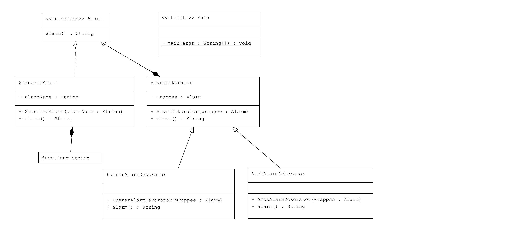

# Mikrokontroling

## BlueJ Kapitel 8 - Klassenentwurf

- Wichtige Punkte am Anfang
  - Zunächst sollte man sich den vorhandenen Code anschauen vor wir mit Refactoring anfangen.
  - Dabei ist es wichtig, auf Code-Duplikate und Abhängigkeiten zwischen Klassen zu achten.
  - Nach Änderungen im Code sollte man immer testen, ob das Programm überall noch richtig funktioniert.
- **_Code Duplizierung_**
  - Duplikate im Code sollten unbedingt vermieden werden.
  - Vorteile: - Der Code bleibt übersichtlich und leichter lesbar. - Änderungen müssen nur an einer Stelle durchgeführt werden.
    Beispiel (schlechter Ansatz – duplizierter Code):

```java
public class Spiel
{
    ...
    private void wechsleRaum(Befehl befehl)
    {
        ...
        System.out.println("Sie sind " + aktuellerRaum.gibBeschreibung());
        System.out.print("Ausg?nge: ");
        if(aktuellerRaum.nordausgang != null) {
            System.out.print("north ");
        }
        if(aktuellerRaum.ostausgang != null) {
            System.out.print("east ");
        }
        if(aktuellerRaum.suedausgang != null) {
            System.out.print("south ");
        }
        if(aktuellerRaum.westausgang != null) {
            System.out.print("west ");
        }
        System.out.println();
    }
    ...
}
```

Dieser Code taucht in mehreren Methoden auf und sollte daher ausgelagert werden.

Verbesserung (eigene Methode erstellen):

```java
public class Spiel
{
    ...
    private void raumInfoAusgeben()
    {
        System.out.println("Sie sind " + aktuellerRaum.gibBeschreibung());
        System.out.print("Ausg?nge: ");
        if(aktuellerRaum.nordausgang != null) {
            System.out.print("north ");
        }
        if(aktuellerRaum.ostausgang != null) {
            System.out.print("east ");
        }
        if(aktuellerRaum.suedausgang != null) {
            System.out.print("south ");
        }
        if(aktuellerRaum.westausgang != null) {
            System.out.print("west ");
        }
        System.out.println();
    }
    private void willkommenstextAusgeben()
    {
        ...
        raumInfoAusgeben();
    }
    ...
}

```

Durch die Methode raumInfoAusgeben() wird der Code nur einmal definiert und mehrfach wiederverwendet.

- **_Koppelung_**

  - Klassen sollten möglichst lose gekoppelt sein, damit Änderungen in einer Klasse nicht sofort viele andere Klassen betreffen.
  - Ziel: Hohe Kohäsion (jede Klasse hat eine klare Aufgabe) und geringe Kopplung.

    Problem (öffentliche Datenfelder):

```java
public class Raum
{
    public String beschreibung;
    public Raum nordausgang;
    public Raum suedausgang;
    public Raum ostausgang;
    public Raum westausgang;
}
```

Jeder kann direkt auf die Attribute zugreifen → schlechte Kapselung.
Beispiel im Spiel:

```java
public class Spiel
{
    private void wechsleRaum(Befehl befehl)
    {
        ...
        Raum naechsterRaum = null;
        if(richtung.equals("north")) {
            naechsterRaum = aktuellerRaum.nordausgang;
        }
        ...
    }
}
```

Verbesserung: Datenfelder private machen + Zugriffsmethode erstellen

```java
public class Raum
{
    private String beschreibung;
    private Raum nordausgang;
    ...
    public Raum gibAusgang(String richtung){
        if(richtung.equals("nord")){
            return nordausgang;
        }
        ....
    }
}
```

Anpassung im Spiel:

```java
public class Spiel
{
    private void wechsleRaum(Befehl befehl)
    {
        ...
        Raum naechsterRaum = null;
        if(richtung.equals("north")) {
            naechsterRaum = aktuellerRaum.gibAusgang("nord");
        }
        ...
    }
}
```

Noch mehr Flexibilität: HashMap für Ausgänge
Statt für jede Richtung ein eigenes Attribut zu haben, kann man eine HashMap nutzen:

```java
public class Raum
{
    private String beschreibung;
    private HashMap<String, Raum> ausgaenge;
    ...
    public void setzeAusgang(String richtung, Raum nachbar){
        ausgaenge.put(richtung,nachbar);
    }
}
```

Schlechter Code (statisch mit 4 Richtungen):

```java
public class Spiel
{
    private void raeumeAnlegen()
    {
        ...
        labor = new Raum("in einem Rechnerraum");
        ...
        labor.setzeAusgaenge(draussen, buero, null, null);
    }
}
```

Verbesserung (HashMap mit beliebigen Richtungen):

```java
public class Spiel
{
    private void raeumeAnlegen()
    {
        ...
        labor = new Raum("in einem Rechnerraum");
        ...
        labor.setzeAusgaenge("nord",bar);
    }
}
```

Dadurch kann man beliebig viele Richtungen hinzufügen, nicht nur nord/ost/süd/west.

**_Kohäsion_**

> Grundgedanken von Kohäsion ist
> Eine Programmeinheit sollte immer nur für genau eine Aufgabe zuständig sein.

- Wenn wir über die **_Kohäsion von Methoden_** sprechen, dann wollen wir dass eine Methode nur für genau eine wohldefinierte Aufgabe zuständig ist.

```java
public void spielen()
{
    System.out.println();
    System.out.println("Wikommen zu Zuul!");
    ...
    System.out.println();
}
private void wilkommensTextAusgeben()
{
    System.out.println();
    System.out.println("Wikommen zu Zuul!");
    ...
}
```

So ist besser

```java
public void spielen()
{
    wilkommensTextAusgeben();
    ...
}
private void wilkommensTextAusgeben()
{
    System.out.println();
    System.out.println("Wikommen zu Zuul!");
}
```

- Regel für die **_Kohäsion von Klassen_** besagt, Eine Klasse mit hoher Kohäsion repräsentiert genau eine wohldefinierte Einheit.
  in Zuul spiel wenn wir in einigen räumen Gegestand zuviegen wollen nicht gute idee ist in Klasse Raum ad data feld Gegestand zu zufügen

```java
public class Raum
{
    private String gegstandBeschreibung;
    private double gegestandGewicht;
    ...
}
```

Bessere lösung ist neue Klasse Gegestand

```java
public class Gegestand
{
    private String beschreibung;
    private double gewicht;
    ...
}
```

**_Refactoring_**

> Refactoring wird die Aktivität genannt, bei der bestehende Klassen und Methoden restrukturiert werden, um sie geänderten Umständen und Anforderungen anzupassen.
> Es bedeutet wir sollen bei Spiel erweitern überlegen ob wir gewisene data felder aus eine in andere klasse zu verschieben und so Koppelung loser zu machen und Kohäsion zu stärken.

## BlueJ Kapitel 15 - Entwurf von Anwendungen

Der objektorientierte Entwurfsprozess gliedert sich in mehrere Phasen. Ziel ist es, von einer Beschreibung der Anforderungen zu einem funktionierenden Programm zu gelangen.

- Anforderungsanalyse
  - Man beschreibt das Systemverhalten aus Sicht des Benutzers.
  - Ziel: Verständnis was das System tun soll.
- Objektanalyse
  - Aus den Anwendungsfällen werden relevante Objekte und Klassen identifiziert.
  - Man sucht **SUBSTANTIVE** -> mögliche **KLASSEN** und **VERBEN** -> mögliche **METHODEN**.
    Beispiel aus dem Kinobuchungssystem:
    | Substantiv | Mögliche Klasse |
    | ----------- | --------------- |
    | Film | `Film` |
    | Vorstellung | `Vorstellung` |
    | Sitz | `Sitz` |
    | Kunde | `Kunde` |
    | Buchung | `Buchung` |
    | Kinosaal | `Kinosaal` |
- Grobentwurf mit hilfe von CRC karten

  - Man legt fest, wie das System aufgebaut ist:
    - Welche Klassen gibt es?
    - Wie kommunizieren sie miteinander?
    - Welche Daten werden gespeichert?
      - **_Class_** -- Name der Klasse, **_„hat ein“_**
      - **_Responsibilities_** -- Aufgaben / Verantwortlichkeiten (Was tut die Klasse), **_„besteht aus“_**
      - **_Collaborators_** -- Mit welchen anderen Klassen arbeitet sie zusammen,**_„ist ein“_**

- Feinentwurf
  - Detaillierte Festlegung der Methoden und Datenattribute.
  - Entwurf von neuen klassen wens notwendig, Schnittstellen und ggf. GUI-Interaktionen.
- Klassen aus dem Entwurf werden in Code umgesetzt.

**_Vergleich von Vorgehensmodellen_**

| Modell                                    | Beschreibung                                                                                                          | Vorteile                                                                         | Nachteile                                                |
| ----------------------------------------- | --------------------------------------------------------------------------------------------------------------------- | -------------------------------------------------------------------------------- | -------------------------------------------------------- |
| **Wasserfallmodell**                      | Lineares Modell mit klar getrennten Phasen (Analyse → Entwurf → Implementierung → Test → Wartung).                    | - Klare Struktur<br>- Einfach zu planen                                          | - Änderungen schwer einbaubar<br>- Späte Fehlererkennung |
| **Iteratives Modell / Agile Entwicklung** | Entwicklung erfolgt in Zyklen („Iterationen“) – Analyse, Entwurf, Implementierung und Test wiederholen sich mehrfach. | - Frühzeitige Rückmeldung<br>- Flexible Anpassung<br>- Besseres Risikomanagement | - Mehr Koordination nötig<br>- Schwerer zu planen        |
| **Prototyping-Modell**                    | Frühe, einfache Versionen werden erstellt, um Anforderungen zu testen.                                                | - Frühes Feedback<br>- Geringes Fehlerrisiko                                     | - Kann zu „Wegwerfcode“ führen                           |

**_Überblick über Entwurfsmuster_**
Entwurfsmuster sind bewährte Lösungen für wiederkehrende Probleme im Softwareentwurf.
| Muster | Zweck | Beispiel im Kinoprojekt |
| ------------------------------- | ------------------------------------------------------------ | ----------------------------------------------------------------------------- |
| **Singleton** | Stellt sicher, dass es nur _eine Instanz_ einer Klasse gibt. | `Buchungsmanager` oder `Kinoprogramm` (zentraler Zugriffspunkt) |
| **Fabrikmethode (Factory)** | Erzeugt Objekte, ohne die genaue Klasse anzugeben. | `TicketFactory` erstellt passende Ticketarten (z. B. Standard, 3D, Kinder) |
| **Beobachter (Observer)** | Mehrere Objekte reagieren auf Änderungen eines anderen. | `Anzeige` aktualisiert sich, wenn `Vorstellung` oder `Sitzplan` geändert wird |
| **Strategie (Strategy)** | Austauschbare Algorithmen zur Laufzeit. | Unterschiedliche Preisberechnungen (Rabatte, VIP, Studenten) |
| **MVC (Model-View-Controller)** | Trennung von Daten, Anzeige und Steuerung. | `Model`: Buchungslogik<br>`View`: GUI<br>`Controller`: Benutzerinteraktion |

## SOLID und sonstige designprinzipien

**_SOLID_**
SOLID ist ein Akronym und steht für:

> **S** – Single Responsibility Principle
> **O** – Open/Closed Principle
> **L** – Liskov Substitution Principle
> **I** – Interface Segregation Principle
> **D** – Dependency Inversion Principle

Alle zusammen sorgen für:

- Hohe Kohäsion
- Geringe Kopplung
- Einfach erweiterbaren Code

_S_
Jede Klasse soll nur eine Aufgabe haben. Wenn wir merken, dass eine Klasse viele verschiedene Dinge tut bitte aufteilen! Mehr als eine Verantwortung für eine Klasse führt zu mehreren Bereichen, in denen zukünftige Änderungen notwendig werden können.
Schlechtes Beispiel:

```java
public class Buchung {
    public void speichereBuchung() { ... }
    public void druckeTicket() { ... }
    public void sendeBestaetigung() { ... }
}
```

Besser:

```java
public class Buchung { ... }
public class TicketDrucker { ... }
public class MailService { ... }

```

_O_
Neue Funktionalität hinzufügen können, ohne bestehenden Code zu ändern. Das erreichen wir mit Vererbung oder Interfaces. dass Software-Einheiten Erweiterungen möglich machen sollen, aber ohne dabei ihr Verhalten zu ändern. Überschriebene Methoden verändern auch nicht das Verhalten der Basisklasse, sondern nur das der abgeleiteten Klasse

Schlechtes Beispiel:

```java
public class RabattRechner {
    public double berechne(double betrag, String typ) {
        if (typ.equals("STUDENT")) return betrag * 0.8;
        if (typ.equals("VIP")) return betrag * 0.7;
        return betrag;
    }
}
```

Besser:

```java
interface RabattStrategie {
    double berechne(double betrag);
}

class StudentenRabatt implements RabattStrategie {
    public double berechne(double betrag) { return betrag * 0.8; }
}

class VIPRabatt implements RabattStrategie {
    public double berechne(double betrag) { return betrag * 0.7; }
}
```

_L_
oder Ersetzbarkeitsprinzip fordert dass eine Instanz sich so verhalten muss, eine Unterklasse darf die Funktionalität der Oberklasse nicht verletzen oder verändern.

Schlechter Beispiel:

```java
class Vogel {
    void fliegen() { ... }
}
class Pinguin extends Vogel {
    void fliegen() { throw new UnsupportedOperationException(); }
}
```

Code, der einen „Vogel“ erwartet, könnte abstürzen.

Besser:
Nur flugfähige Vögel implementieren „fliegen()“.

```java
class Vogel { ... }
class FlugfaehigerVogel extends Vogel {
    void fliegen() { ... }
}
class Pinguin extends Vogel { ... }

```

_I_
Klassen sollen nicht gezwungen sein, Methoden zu implementieren, die sie nicht brauchen. Es dient dazu, zu große Interfaces aufzuteilen. Die Aufteilung soll gemäß den Anforderungen passen. Ist es möglich eine Software derart in Klassen aufzuteilen, dass zukünftige fachliche oder technische Anforderungen an die Software nur geringe Änderungen an der Software selbst benötigen.

Schlechtes Beispiel:

```java
interface Drucker {
    void drucken();
    void scannen();
    void faxen();
}

class EinfacheDrucker implements Drucker {
    public void drucken() { ... }
    public void scannen() { throw new UnsupportedOperationException(); }
    public void faxen() { throw new UnsupportedOperationException(); }
}

```

Besser:

```java
interface Drucker { void drucken(); }
interface Scanner { void scannen(); }
interface Fax { void faxen(); }

class EinfacheDrucker implements Drucker { ... }
class Multifunktionsgeraet implements Drucker, Scanner, Fax { ... }

```

_D_
Hohe Module sollen sich nicht direkt auf konkrete Implementierungen stützen, sondern auf Interfaces oder Abstraktionen. Reduktion der Kopplung von Modulen dass Abhängigkeiten immer von konkreteren Modulen niedriger Ebenen zu abstrakten Modulen höherer Ebenen gerichtet sein sollten.

**_DRY_**

> _DRY_ = Don’t Repeat Yourself
> „Wiederhole dich nicht.“
> _Ziel_: Jede Information oder Logik sollte nur einmal im Code existieren.

Anti Beispiel:

```java
public void zeigeRaumInfo() {
    System.out.println("Sie sind " + aktuellerRaum.gibBeschreibung());
    System.out.print("Ausgänge: ");
    if (aktuellerRaum.nordausgang != null) System.out.print("north ");
    ...
}

public void willkommenstext() {
    ...
    System.out.println("Sie sind " + aktuellerRaum.gibBeschreibung());
    System.out.print("Ausgänge: ");
    if (aktuellerRaum.nordausgang != null) System.out.print("north ");
    ...
}
```

Beispiel mit DRY Prinzipien:

```java
private void raumInfoAusgeben() {
    System.out.println("Sie sind " + aktuellerRaum.gibBeschreibung());
    System.out.print("Ausgänge: ");
    if (aktuellerRaum.nordausgang != null) System.out.print("north ");
    ...
}

public void zeigeRaumInfo() {
    raumInfoAusgeben();
}

public void willkommenstext() {
    ...
    raumInfoAusgeben();
}
```

- Warum ist DRY so wichtig?
  - Weniger Fehlerquellen, Änderungen müssen nur an einer Stelle vorgenommen werden.
  - Besser wartbar, Der Code bleibt übersichtlich und konsistent.
  - Bessere Verständlichkeit, Logik ist klarer.
- Arten von Duplizierung, die DRY vermeiden will
  - Code-Duplizierung: Mehrfach kopierter Code, Extrahiere Methode oder Klasse
  - Daten-Duplizierung: Gleiche Daten in mehreren Klassen, Gemeinsame Datenquelle oder Modell
- Best Practices zur Umsetzung von DRY:
  - Refaktoriere wiederholten Code in eigene Methoden, wie raumInfoAusgeben().
  - Vererbung oder Interfaces nutzen
  - Design Patterns anwenden, wie Factory, Singleton, Strategy etc. helfen, redundante Code-Strukturen zu vermeiden
  - Früh testen und iterativ verbessern.

**_KISS_**

> KISS steht für Keep It Simple, Stupid
> oder höflicher: Keep It Short and Simple.
> Das bedeutet: Mach es so einfach wie möglich – aber nicht einfacher.

- Idee
  - einfach, klar und verständlich aufgebaut sein,
  - nicht unnötig komplex,
  - und leicht zu warten und zu erweitern sein.

Kompliziert

```java
if(befehl.equals("go") && raum.equals("north") && hatSchluessel == true && !monsterIstDa) {
}
```

Einfach

```java
if (befehl.equals("go")) {
    wechsleRaum(richtung);
}
```

- Best Practices für KISS

  - Kleine, überschaubare Methoden, Eine Methode = eine Aufgabe
  - Klassen nach Verantwortlichkeiten trennen, Eine Klasse = ein Zweck
  - Einfache Datentypen & Strukturen
  - chrittweise entwickeln

KISS-Motto für Entwickler:

> _"Simplicity is the ultimate sophistication."_ – **_Leonardo da Vinci_**

oder

> _"Wenn du deinen eigenen Code in zwei Wochen nicht mehr verstehst – ist er nicht KISS."_

**_YAGNI_**

> YAGNI bedeutet:
> **_„You Aren’t Gonna Need It“_** > **„Du wirst es nicht brauchen.“**
> „Implementiere nur das, was jetzt benötigt wird – nicht das, was vielleicht irgendwann gebraucht werden könnte.“

- Ziel von YAGNI

  - Fokus auf aktuelle Anforderungen
  - Vermeidung unnötiger Komplexität
  - Schnellere, einfachere Implementierung
  - Bessere Lesbarkeit & Wartbarkeit

- Verstöße gegen YAGNI
  - Unnötige Komplexität
  - Over-Engineering
  - Unnötige Abstraktion

Schlechter beispiel

```java
public class Buchung {
    private String sitzplatz;
    private String bezahlMethode; // aktuell immer "bar"
    private String rabattCode; // (noch nicht verwendet)
    private boolean istOnline; // (vielleicht später)
    ...
}
```

- YAGNI richtig umsetzen:
  - Entwickle nur, was aktuell im Use Case gefordert ist.
  - Wenn sich Anforderungen ändern, dann erweitern.

richtig umgesetzter YAGNI

```java
public class Buchung {
    private Sitz sitz;
    private Vorstellung vorstellung;
    private double preis;
}
```

Prinzipien vergleich:

| Prinzip   | Bedeutung                | Fokus                               |
| --------- | ------------------------ | ----------------------------------- |
| **KISS**  | Keep It Simple, Stupid   | Einfachheit und Verständlichkeit    |
| **DRY**   | Don’t Repeat Yourself    | Keine Code-Redundanz                |
| **YAGNI** | You Aren’t Gonna Need It | Kein unnötiger Funktionsumfang      |
| **SOLID** | 5 OO-Design-Prinzipien   | Strukturierte, flexible Architektur |


## ENTWURFSMUSTER

Muster sind ein Werkzeugkasten mit Lösungen für häufige Probleme im Softwaredesign. Sie definieren eine gemeinsame Sprache, die Ihrem Team hilft, effizienter zu kommunizieren.
Designmuster unterscheiden sich in ihrer Komplexität, ihrem Detaillierungsgrad und ihrem Anwendungsbereich. Darüber hinaus können sie nach ihrer Absicht kategorisiert und in drei Gruppen unterteilt werden:

Verschiedene Typen von Entwurfsmustern:

    - Erzeugungsmuster (Creational Patterns)
    - Strukturmuster (Structural Patterns)
    - Verhaltensmuster (Behavioral Patterns)

_Erzeugungsmuster_

Stellen Sie Mechanismen zur Objekterstellung bereit, die die Flexibilität und Wiederverwendung vorhandenen Codes erhöhen. Implementierung gemäß der Regel: **_„Programmiere auf die Schnittstelle, nicht auf die Implementierung!“_**

    - Builder
    - ...

**Builder**

Das Builder-Pattern wird genutzt, wenn die Konstruktion eines komplexen Objektes von seiner Repräsentation getrennt werden soll. Das Objekt (**Salat**) konstruiert sich also nicht selber, sondern wird von einem anderen Objekt (**SalatMachen**) erbaut.

```java
public class Main {
    public static void main(String[] args) {
        //neuen objekt erstellen von typ CesarSalat
        SalatMachen hersteller = new CesarSalat();
        //neuen objekt erstellen von typ SalatHersteller und als parametar CesarSalat eingeben
        SalatHersteller macher = new SalatHersteller(hersteller);
        //aufruf von Objekt klasse
        macher.salatRichten();
        //Objekt wert zuweisen über methode
        Salat salat = macher.getSalat();
        System.out.println(salat);
    }
}

public class Salat {
    //daten felder
    private String gemuese;
    private String dressing;
    private String gewuerze;
    private String beilage;

    //set methoden für data felder
    public void setGemuese(String gemuese) {
        this.gemuese = gemuese;
    }
    public void setDressing(String dressing){
        this.dressing = dressing;
    }
    public void setGewuerze(String gewuerze){
        this.gewuerze = gewuerze;
    }
    public void setBeilage(String beilage){
        this.beilage = beilage;
    }
    //ausgabe als String überschreiben
    @Override
    public String toString() {
        return "Salat: salat ist: " + this.gemuese + ", dressing ist: "+ this.dressing + ", gewuerze sind: "+this.gewuerze + " und beilage sind: "+this.beilage;
    }
}
//interface erstellen mit methoden die wir brauchen um Objecte zu BUILDEN
public interface SalatMachen {
    void gemueseSchneiden();
    void dressingVorbereiten();
    void gewuerzeRichten();
    void beilageReintun();
    //gib ergebni wieder zurick
    Salat getSalat();
}
//Spetziefisches object implements interface
public class CesarSalat implements SalatMachen{
    private Salat salat;
    //Konstruktor um neue Objekt zu erzeugen
    public CesarSalat(){
        this.salat = new Salat();
    }
    public void gemueseSchneiden(){
        salat.setGemuese("Gruene Salat");
    }
    public void dressingVorbereiten(){
        salat.setDressing("Cieser dressing");
    }
    public void gewuerzeRichten(){
        salat.setGewuerze("Saltz und Pepper");
    }
    public void beilageReintun(){
        salat.setBeilage("Hendel");
    }
    public Salat getSalat(){
        return this.salat;
    }
}
//Objekt gib komand für herstellen
public class SalatHersteller {
    private SalatMachen hersteller;

    public SalatHersteller(SalatMachen hersteller) {
        this.hersteller = hersteller;
    }
    //ruft intarace methoden
    public void salatRichten() {
        hersteller.gemueseSchneiden();
        hersteller.dressingVorbereiten();
        hersteller.gewuerzeRichten();
        hersteller.beilageReintun();
    }
    public Salat getSalat() {
        return hersteller.getSalat();
    }
}

```


_Strukturmuster_

Erleichtern den Entwurf von Software durch vorgefertigte Schablonen für Beziehungen zwischen Klassen. Erklären Sie, wie Sie Objekte und Klassen zu größeren Strukturen zusammenfügen und dabei die Flexibilität und Effizienz dieser Strukturen wahren.

    - Dekodierer
    - Adapter
    - ...

**Dekodierer**

Das Muster ist eine flexible Alternative zur Unterklassenbildung, um eine Klasse um zusätzliche Funktionalitäten zu erweitern.

```java
public class Main {
    public static void main(String[] args) {
        //Dekoratoer erzugt neuen Objekt der supdekorator ist und hat als parameter normale message
        AlarmDekorator a = new AmokAlarmDekorator(new StandardAlarm("Amokkkkkkk"));
        System.out.println(a.alarm());
    }
}

public interface Alarm {
    //Notifier
    String alarm();
}

public class StandardAlarm implements Alarm{

    private String alarmName;

    /**
     * Konstructor
     * @param alarmName
     */
    public StandardAlarm(String alarmName){
        this.alarmName = alarmName;
    }
    /**
     *
     * @return diese nachricht zurück
     */
    @Override
    public String alarm() {
        return this.alarmName;
    }
}
public class AlarmDekorator implements Alarm{
    /**
     * Data feld von Object Alarm als wraper
     */
    private Alarm wrappee;
    public AlarmDekorator(Alarm wrappee){
        this.wrappee = wrappee;
    }

    /**
     *
     * @return wrappee alarm
     */
    @Override
    public String alarm() {
        return wrappee.alarm();
    }
}

public class AmokAlarmDekorator extends AlarmDekorator{

    public AmokAlarmDekorator(Alarm wrappee){
        super(wrappee);
    }

    /**
     *
     * @return wraper alarm
     */

    @Override
    public String alarm() {
        return "AMOK ALARM: " + super.alarm().toUpperCase() + " 🚨";
    }
}

public class FuererAlarmDekorator extends AlarmDekorator{

    public FuererAlarmDekorator(Alarm wrappee){
        super(wrappee);
    }

    @Override
    public String alarm() {
        return " FUERER ALARM "+super.alarm();
    }
}


```



**Adapter**

Der Adapter findet Anwendung, wenn eine existierende Klasse verwendet werden soll, deren Schnittstelle nicht der benötigten Schnittstelle entspricht. Dies tritt insbesondere dann auf, wenn Klassen, die zur Wiederverwendung konzipiert wurden. Diese stellen ihre Dienste durch klar definierte Schnittstellen zur Verfügung, die in der Regel nicht geändert werden sollen und häufig auch nicht geändert werden können, da sie von Dritten stammen.

```java
public class Main {
    public static void main(String[] args) {
        //erzeugen von Serbisch sprecher objekt
        SerbischSprecher srbin = new SerbischSprecher();
        //objekt übersetzer erzeugen
        Uebersetzer uebersetzer = new SerbischToDeutschUebersetzen(srbin);
        //gsesprech objekt erzeugen
        Gesprech gesprech = new Gesprech(uebersetzer);
        //aufruf von übersetz methode
        gesprech.ubersetzen();
    }
}
public interface Uebersetzer {
    void uebersetz();
}

//klasse über nur serbisch sprecher
public class SerbischSprecher {
    public void sprichSerbisch(){
        System.out.println("Ich spreche nur serbisch");
    }
}

//klasse soll von serbisch auf deutsch übersetzen
public class SerbischToDeutschUebersetzen implements Uebersetzer{
    private SerbischSprecher srb;

    public SerbischToDeutschUebersetzen(SerbischSprecher srb){
        this.srb = srb;
    }

    /**
     * Methode die als adapter genutzt wird für übersetzung von
     * serbisch auf deutch
     */
    public void uebersetz(){
        this.srb.sprichSerbisch();
    }
}

public class Gesprech {
    private Uebersetzer uebersetzen;

    public Gesprech(Uebersetzer uebersetzen) {
        this.uebersetzen = uebersetzen;
    }
    public void  ubersetzen(){
        this.uebersetzen.uebersetz();
    }
}

```


_Verhaltensmuster_

Modellieren komplexes Verhalten der Software. Kümmern sich um eine effektive Kommunikation, erhöhen damit die Flexibilität und die Zuweisung von Verantwortlichkeiten zwischen Objekten.

    - Chain of Responsibility
    - TemplateMethod
    - Observer
    - ...

**Chain of Responsibility**

Mehrere Objekte werden hintereinander geschaltet (miteinander verkettet), um gemeinsam eine eingehende Anfrage bearbeiten zu können. Diese Anfrage wird an der Kette entlang geleitet, bis eines der Objekte die Anfrage beantworten kann. Der Klient, von dem die Anfrage ausgeht, hat dabei keine Kenntnis darüber, von welchem Objekt die Anfrage beantwortet werden wird.

Es muss sichergestellt werden, dass jeder Bearbeiter in der Kette nur einmal vorkommt, sonst entstehen Kreise und das Programm bleibt in einer Endlosschleife hängen.

```java
public class Main {
    public static void main(String[] args) {
        //von jede einzelne klasse objekt erstellen
        BankInfo kontoInfo = new KontoTarifInfo();
        BankInfo creditInfo = new CreditCardInfo();
        BankInfo lisingInfo = new LisingInfo();
        //metode setNext aufrufen
        kontoInfo.setNextInfo(creditInfo);
        creditInfo.setNextInfo(lisingInfo);
        //<unterschiedliche szenarien
        System.out.println("Interesse an Konto tarifen info");
        kontoInfo.infoFragen("Konto tarifen info");
        System.out.println();
        System.out.println("Interesse an Credit Card info");
        kontoInfo.infoFragen("Credit Card info");
        System.out.println();
        System.out.println("Interesse an Lising Info");
        kontoInfo.infoFragen("Lising Info");
    }
}

public interface BankInfo {
    void setNextInfo(BankInfo bankInfo);
    void infoFragen(String frage);
}

public class KontoTarifInfo implements BankInfo{
    private BankInfo bankInfo;

    /**
     *
     * @param bankInfo weche klasse ist nexte
     */
    public void setNextInfo(BankInfo bankInfo){
        this.bankInfo = bankInfo;
    }

    /**
     *
     * @param frage als String übernimt problem
     * Wenn problem diese klasse lösen kann dann gibt sie ergebnis
     * wenn nicht gibt sie an weitere klasse an
     */
    @Override
    public void infoFragen(String frage) {
        if(frage.equalsIgnoreCase("Konto tarifen info")){
            System.out.println("Es gibt so vielen Konto Tarifen");
        }
        else{
            System.out.println("KontoTarifInfo: Frage nicht beanwortet - weiter an  CrditCardInfo");
            if(bankInfo != null){
                bankInfo.infoFragen(frage);
            }
        }

    }
}

public class CreditCardInfo implements BankInfo{

    private BankInfo bankInfo;
    /**
     *
     * @param bankInfo weche klasse ist nexte
     */
    public void setNextInfo(BankInfo bankInfo){
        this.bankInfo = bankInfo;
    }
    /**
     *
     * @param frage als String übernimt problem
     * Wenn problem diese klasse lösen kann dann gibt sie ergebnis
     * wenn nicht gibt sie an weitere klasse an
     */
    @Override
    public void infoFragen(String frage) {
        if(frage.equalsIgnoreCase("Credit Card info")){
            System.out.println("Credit carten frage geloest");
        }
        else{
            System.out.println("CreditCardInfo: Frage nicht beanwortet - weiter an  LisingInfo");
            if(bankInfo != null){
                bankInfo.infoFragen(frage);
            }
        }

    }
}

public class LisingInfo implements BankInfo{
    private BankInfo bankInfo;
    /**
     *
     * @param bankInfo weche klasse ist nexte
     */
    public void setNextInfo(BankInfo bankInfo){
        this.bankInfo = bankInfo;
    }
    /**
     *
     * @param frage als String übernimt problem
     * Diese klasse ist letzte sie gibt antwort
     */
    @Override
    public void infoFragen(String frage) {
        if(frage.equalsIgnoreCase("Lising Info")){
            System.out.println("Alle fragen geklert");
        }
    }
}
```


**TemplateMethod**

Die Schablonenmethode (englisch template method pattern) ist ein in der Softwareentwicklung eingesetztes Entwurfsmuster, mit dem Teilschritte eines Algorithmus variabel gehalten werden können.

Beim Schablonenmethoden-Entwurfsmuster wird in einer abstrakten Klasse das Skelett eines Algorithmus definiert. Die konkrete Ausformung der einzelnen Schritte wird an Unterklassen delegiert.Dadurch besteht die Möglichkeit, einzelne Schritte des Algorithmus zu verändern oder zu überschreiben, ohne dass die zu Grunde liegende Struktur des Algorithmus modifiziert werden muss. Die Schablonenmethode ruft abstrakte Methoden auf, die erst in den Unterklassen definiert werden. Diese Methoden werden auch als Einschubmethoden bezeichnet.

```java
public class Main {
    public static void main(String[] args) {
        //herstellen von objecte
        FlugReise prio = new PriorityFlug();
        FlugReise eco = new EconomicFlug();
        // hautp methode aufrufen
        prio.flugReise();
        eco.flugReise();
    }
}

public abstract class FlugReise {
    //in diese methode werden alle untere methode ausgefürt
    public final void flugReise(){
        checkIn();
        sicherheitCheck();
        bording();
        flug();
        gepaeckAbholen();
    }
    //nechte 3 methoden sind gleich für allen anderen klassen
    private void checkIn(){
        System.out.println("Bitte eure Dockumente zeigen!");
    }
    private void flug(){
        System.out.println("6 Std. flig Zeit!!");
    }
    private void gepaeckAbholen(){
        System.out.println("Bitte nehmen Sie euren Gepäck!!!!");
    }
    //diese zwei methode sind bei sub klassen unterschiedlich
    public abstract void sicherheitCheck();
    public abstract void bording();
}

public class PriorityFlug extends FlugReise{
    //implementiere 2 methode die sind untersceiden
    public void sicherheitCheck(){
        System.out.println("Bitte alle Pasagiere mit Priority pass zu kontrolle");
    }
    public void bording(){
        System.out.println("Bitte alle Pasagiere mit Priority pass ins Flieger zu steigen");
    }
}

public class EconomicFlug extends FlugReise{
    public void sicherheitCheck(){
        //implementiere 2 methode die sind untersceiden
        System.out.println("Bitte alle Pasagiere mit Economic pass platz für Pasagiere mit Priority pass zu machen, dann sin sie dran");
    }
    public void bording(){
        System.out.println("Bitte alle Pasagiere mit Economic pass ins Flieger zu steigen");
    }
}
```


**Observer**

dient der Weitergabe von Änderungen an einem Objekt an von diesem Objekt abhängige Strukturen.

Allgemein finden Beobachter-Muster Anwendung, wenn eine Abstraktion mehrere Aspekte hat, die von einem anderen Aspekt derselben Abstraktion abhängen, wo Änderung eines Objekts Änderungen an anderen Objekten nach sich zieht oder ein Objekt andere Objekte benachrichtigen soll, ohne diese im Detail zu kennen.

```java
public class Main {
    public static void main(String[] args) {
        // object aucion tag erstellen
        AuctionsTag acTag = new AuctionsTag();
        //aauctionen für mobitel und web erstellen
        Auction mobil = new MobileAuction();
        Auction web =  new WebAuction();
        //sie ins Liste hinzufigen
        acTag.autoHinzufuegen(mobil);
        acTag.autoHinzufuegen(web);
        //informationen erstellen
        System.out.println("Erste Auction");
        acTag.setInfo("VW","ID3",45990.90);

        System.out.println("Zweite Auction");
        acTag.setInfo("BMW","M135XDrive",65000.00);
    }
}

public interface Auction {
    void update(String autoMarke, String autoModel, double preis);
}

public interface AutoAuction {
    void autoHinzufuegen( Auction auct);
    void autoEntfernen(Auction auct);
    void information();
}

import java.util.ArrayList;

public class AuctionsTag implements AutoAuction{
    private ArrayList<Auction>  auctions = new ArrayList<>();
    private String autoMarke, autoModel;
    private double preis;

    public void autoHinzufuegen( Auction auct){
        auctions.add(auct);
    }
    public void autoEntfernen(Auction auct){
        auctions.remove(auct);
    }
    public void information(){
        for( Auction auction : auctions ){
            auction.update(autoMarke, autoModel, preis);
        }
    }

    public void setInfo(String autoMarke, String autoModel, double preis){
        this.autoMarke = autoMarke;
        this.autoModel = autoModel;
        this.preis = preis;
        information();
    }
}

public class MobileAuction implements Auction {
    public void update(String autoMarke, String autoModel, double preis){
        System.out.println("Handy -> Auto Marke: "+autoMarke+" Auto Model: "+autoModel+" Preis: "+preis );
    }
}

public class WebAuction implements Auction {
    public void update(String autoMarke, String autoModel, double preis){
        System.out.println("WebApp -> Auto Marke: "+autoMarke+" Auto Model: "+autoModel+" Preis: "+preis );
    }
}
```


### Aufgabe

```java
public interface IUmrechnen{
    double umrechnen(String variante, double betrag);

    double getFaktor();

    boolean zustaendig(String variante);
}


public interface ISammelumrechnung{
    public double sammelumrechnen(double[] betraege, String variante);

}

public abstract class WR implements IUmrechnen{

    public double umrechnen(String variante, double betrag);

}
```

    ***Chain of Responsibility, TemplateMethod und Dekorator***

    _CHAIN OF RESPONSIBILITY_

Erstellen Sie eine Verantwortlichkeitskette mit mindestens zwei Währungsrechnern (z.B. EUR2YEN, EURO2Dollar). Neben dem Standardverhalten einer Zuständigkeitskette soll es möglich sein, neue Währungsrechner in die Kette aufzunehmen bzw. bestehende aus der Kette zu löschen (jeweils am Ende der Kette). Die Mutterklasse der Chain ist die abstrakte WR-Klasse. Diese implementiert die Ketten-Weiterleitung in der Methode umrechnen(). Die Zuständigkeit sowie der Umrechnungsfaktor für die Umrechnung wird in den Unterklassen geklärt (Template Method).

    _TEMPLATE METHOD_

Implementieren Sie die Template-Methode umrechnen() in der abstrakten Klasse WR. Delegieren Sie ausschließlich die für die jeweiligen Umrechner spezifischen Methoden (zustaendig(), faktor()) zur Implementierung an die konkreten Währungsrechner-Unterklassen von WR (Hook-Methoden der Unterklassen).

    _DEKORATOR_

Implementieren Sie ein System von Decorators, das Währungsrechner des Typen IUmrechnen dekorieren kann. Folgende Decorators sind z.B. sinnvoll und möglich:

    - Belegung eines Umrechnungsvorganges mit Gebühren (z.B. 0,5 % des Umrechnungsbetrages)
    - Belegung eines Umrechnungsvorganges für Umrechnungen von Euro nach Währung X (nicht in die andere Richtung) mit fixen Gebühren von 5 Euro.

    Hinweis: Leiten Sie dazu zunächst einen abstrakten Decorator von WR ab und implementieren Sie alle abstrakten Methoden sowie umrechnen() als transparente Weiterleitungen an den dekorierten Nächsten. Implementieren Sie dann in zwei weiteren Subklassen dieser abstraktoren Decorator-Klasse die umrechnen Methode neu, sodass die gewünschte Verhaltensänderung des Systems resultiert.

```java
public class Main {
    public static void main(String[] args) {
        //neuen object eur2dol erzeugen
        WR e2d = new Eur2Dol();
        //zufigen von nexten
        e2d.setWeiter(new Eur2Yen());
        //ausgabe für umrechnen in chain of responsibility
        System.out.println("Eur2Yen: " +e2d.umrechnen("eur2yen",100));
        System.out.println("Eur2Dol: "+e2d.umrechnen("eur2dol",100));

        System.out.println();
        //Dekoratoren aufruf
        WR mitProzent= new ProzentDekorator(e2d, 0.05);
        WR mitFix = new FixDekorator( mitProzent,"Eur2Dol", 5.0);
        System.out.println(mitFix.umrechnen("eur2dol",100));

        WR e2y = new Eur2Yen();
        WR mitProzent2= new ProzentDekorator(e2y, 0.05);
        WR mitFix2 = new FixDekorator( mitProzent2,"Eur2Yen", 5.0);
        System.out.println(mitFix2.umrechnen("eur2yen",100));
    }
}

public interface IUmrechnen {
    double umrechnen(String variante, double betrag);
    double getFaktor();
    boolean zustaendig(String variante);
}

public abstract class WR implements IUmrechnen{
    private WR weiter;

    public abstract double umrechnen(String variante, double betrag);
    public WR getWeiter(){
        return this.weiter;
    }
    public void setWeiter(WR weiter){
        this.weiter = weiter;
    }
}

public class Eur2Yen extends WR{
    private double faktor = 176.13;
    //rechnet wenn variante entspricht euro in yen
    public double umrechnen(String variante, double betrag){
        if(zustaendig(variante)){
             return  betrag * getFaktor();
        }
        else{
            // ermöglicht erweiterung
            if(this.getWeiter() !=null){
                return this.getWeiter().umrechnen(variante, betrag);
            }
            else{
                throw new NullPointerException("Eur2Yen");
            }
        }
    }
    //gib faktor retur
    public double getFaktor(){
        return faktor;
    }
    //kann neuen facror setzen
    public void setFaktor(double faktor){
        this.faktor = faktor;
    }
     // gir zurück true oder false abhängig von variante
    public boolean zustaendig(String variante){
        return(variante.equalsIgnoreCase("Eur2Yen"));
    }
}

public class Eur2Dol extends WR{
    private double faktor = 1.16;
    //rechnet wenn variante entspricht euro in dolar
    public double umrechnen(String variante, double betrag){
        if(zustaendig(variante)){
            return  betrag * getFaktor();
        }
        else{
            // ermöglicht erweiterung
            if(this.getWeiter() !=null){
                return this.getWeiter().umrechnen(variante, betrag);
            }
            else{
                throw new NullPointerException("Eur2Dol");
            }
        }
    }
    //gib faktor retur
    public double getFaktor(){
        return faktor;
    }
    //kann neuen facror setzen
    public void setFaktor(double faktor){
        this.faktor = faktor;
    }
    // gir zurück true oder false abhängig von variante
    public boolean zustaendig(String variante){
        return (variante.equalsIgnoreCase("Eur2Dol"));
    }
}

public class WRDecorator extends WR{
    private WR wrapee;
    public WRDecorator(WR wrapee){
        this.wrapee = wrapee;
    }
    //dekorator wrapee
    @Override
    public double umrechnen(String variante, double betrag) {
        return wrapee.umrechnen(variante, betrag);
    }

    @Override
    public double getFaktor() {
        return wrapee.getFaktor();
    }
    @Override
    public boolean zustaendig(String variante) {
        return wrapee.zustaendig(variante);
    }
}

public class ProzentDekorator extends WRDecorator {
    private double prozent;
    public ProzentDekorator(WR wrapee, double prozent) {
        super(wrapee);
        this.prozent = prozent;
    }
    //umrechnen methode die erweitert dekorator und nutzt prozente
    @Override
    public double umrechnen(String variante, double betrag) {
        double umgerechnet =  super.umrechnen(variante, betrag);
        double prozes = prozent*umgerechnet;
        double gesamt = prozes+umgerechnet;
        System.out.println("Umgerechtet: "+umgerechnet+", gebuer:"+prozent+", ist gesamt:"+gesamt);
        return gesamt;
    }
}

public class FixDekorator extends WRDecorator{
    private double gebuer;
    private String variante;

    public FixDekorator(WR wrapee, String variante,double gebuer){
        super(wrapee);
        this.variante = variante;
        this.gebuer=gebuer;
    }
    //umrechnen methode die erweitert dekorator und nutzt gebür
    public double umrechnen(String variante, double betrag) {
        double umgerechnet =  super.umrechnen(variante, betrag);
        if (variante.equalsIgnoreCase(this.variante)){
            double gesamt = gebuer+umgerechnet;
            System.out.println("Umgerechtet: "+umgerechnet+", gebuer:"+gebuer+", ist gesamt:"+gesamt);
            return gesamt;
        }
        return umgerechnet;
    }
}
```


