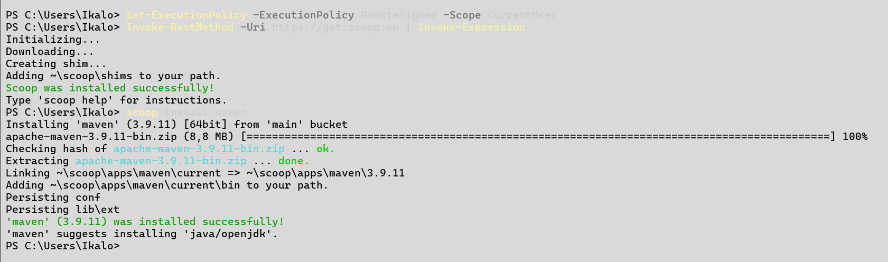
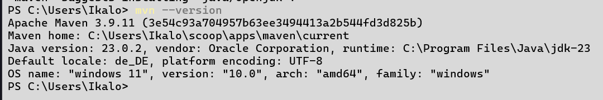
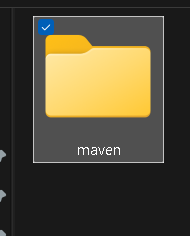
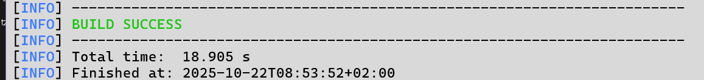
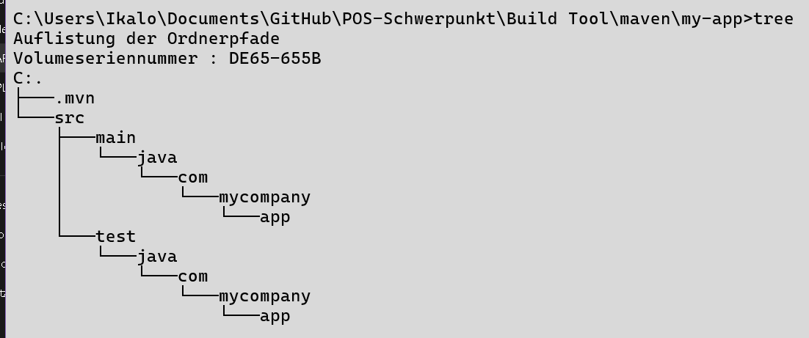
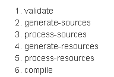
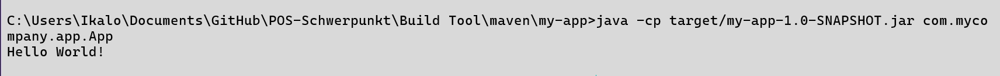
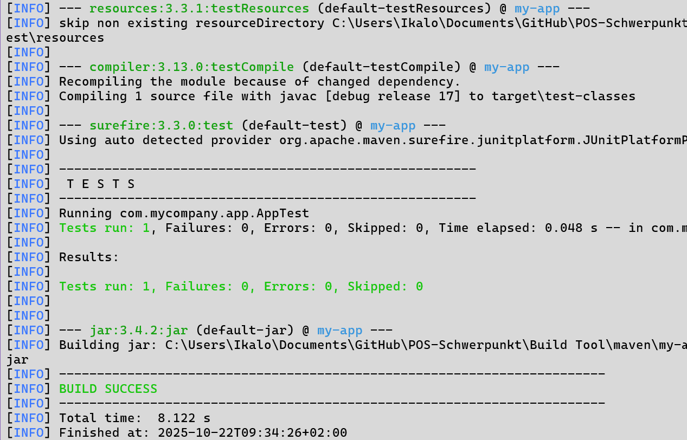
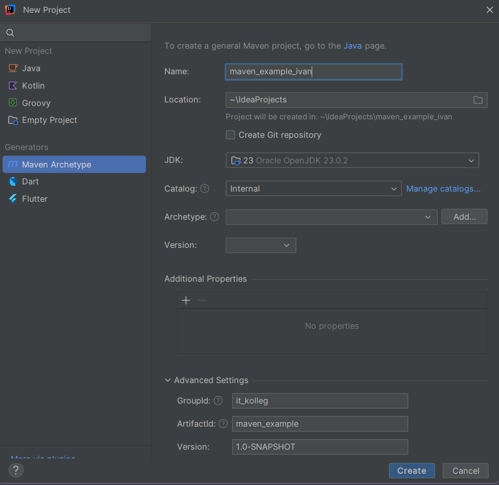
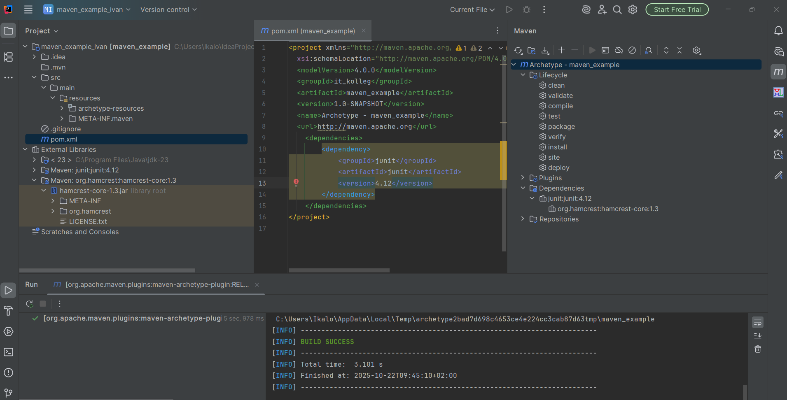

# MAVEN

## AUFGABE 1: MAVEN IN 5 MINUTES

Vor Marven installation habe ich erst Scoop instalier

```powershell
Set-ExecutionPolicy -ExecutionPolicy RemoteSigned -Scope CurrentUser
Invoke-RestMethod -Uri https://get.scoop.sh | Invoke-Expression
```

dann ist Marven dran

```cmd
scoop install main/maven
```



version zeigen lassen.

```powershell
mvn --version
```



    ***Creating Project***



```cmd
mvn archetype:generate -DgroupId=com.mycompany.app -DartifactId=my-app -DarchetypeArtifactId=maven-archetype-quickstart -DarchetypeVersion=1.5 -DinteractiveMode=false
```

```powershell
mvn archetype:generate
```

- Startet das Maven-Plugin Archetype, das ein neues Projekt aus einer Vorlage erzeugt.

```powershell
-DgroupId=com.mycompany.app
```

- Legt den Group-Identifier fest.
  - Das ist wie ein eindeutiger Paketname (meist in umgekehrter Domainform).
  - Wird z. B. als package com.mycompany.app; im Quellcode verwendet.

```powershell
-DartifactId=my-app
```

- Wählt die Vorlage, die verwendet werden soll.
  - maven-archetype-quickstart ist eine einfache Vorlage für ein Standard-Java-Projekt mit:
    - src/main/java und src/test/java Verzeichnissen
    - einer Beispiel-Java-Klasse
    - einer Beispiel-JUnit-Testklasse

```powershell
-DarchetypeVersion=1.5
```

- Gibt die Version der Vorlage an (hier Version 1.5 des maven-archetype-quickstart).

```powershell
-DinteractiveMode=false
```

- Sorgt dafür, dass Maven keine Fragen mehr stellt (z. B. nach Projektname, Package, Version).
  Alles wird automatisch mit den angegebenen Parametern erstellt.



dann ins folder my-app wechseln und mit

```powershell
tree
```



#### Build the Project

```powershell
mvn package
```

- Anders als der erste ausgeführte Befehl (archetype:generate) besteht der zweite lediglich aus einem einzigen Wort – Paket. Statt eines Ziels handelt es sich hier um eine Phase. Eine Phase ist ein Schritt im Build-Lebenszyklus, der eine geordnete Abfolge von Phasen darstellt. Wenn eine Phase angegeben ist, führt Maven jede Phase der Sequenz bis einschließlich der definierten Phase aus. Wenn Sie beispielsweise die Kompilierphase ausführen, werden die folgenden Phasen tatsächlich ausgeführt:



und testen

```powershell
java -cp target/my-app-1.0-SNAPSHOT.jar com.mycompany.app.App
```



#### Maven Phases

Obwohl dies keine vollständige Liste ist, handelt es sich hier um die am häufigsten ausgeführten Standardphasen des Lebenszyklus.

Validieren: Überprüfen, ob das Projekt korrekt ist und alle erforderlichen Informationen verfügbar sind.
Kompilieren: Kompilieren des Quellcodes des Projekts.
Testen: Testen des kompilierten Quellcodes mit einem geeigneten Unit-Test-Framework. Für diese Tests sollte der Code nicht paketiert oder bereitgestellt werden müssen.
Paketieren: Verpacken des kompilierten Codes in ein verteilbares Format, z. B. eine JAR-Datei.
Integrationstest: Verarbeiten und Bereitstellen des Pakets in einer Umgebung, in der Integrationstests ausgeführt werden können.
Verifizieren: Überprüfen, ob das Paket gültig ist und die Qualitätskriterien erfüllt.
Installieren: Installieren des Pakets im lokalen Repository zur lokalen Verwendung als Abhängigkeit in anderen Projekten.
Bereitstellen: Wird in einer Integrations- oder Release-Umgebung ausgeführt und kopiert das fertige Paket in das Remote-Repository, um es mit anderen Entwicklern und Projekten zu teilen.

Neben der oben aufgeführten Standardliste gibt es noch zwei weitere wichtige Maven-Lebenszyklen. Diese sind:

Clean: Bereinigen von Artefakten, die durch vorherige Builds entstanden sind.
Site: Erstellen der Site-Dokumentation für dieses Projekt.

Phasen sind den zugrunde liegenden Zielen zugeordnet. Die spezifischen Ziele, die pro Phase ausgeführt werden, hängen vom Pakettyp des Projekts ab. Beispielsweise führt das Paket jar:jar aus, wenn der Projekttyp ein JAR ist, und war:war, wenn der Projekttyp – Sie haben es erraten – ein WAR ist.

Interessant ist, dass Phasen und Ziele nacheinander ausgeführt werden können.

```powershell
mvn clean dependency:copy-dependencies package
```



#### Generating the Site

```powershell
mvn site
```

In dieser Phase wird eine Site basierend auf Informationen zum POM des Projekts generiert. Sie können die generierte Dokumentation unter target/site einsehen.

## AUFGABE 2: INTELLIJ UND MAVEN

Maven Projekt in IntelliJ erstellen



Wir Bekommen folder struktur und können Dipendeci erstellen



Mit Maven in IntalliJ sparen wir vile code in CMD weil Maven alle für uns macht.

#### Guava

```maven
<dependency>
        <groupId>com.google.guava</groupId>
        <artifactId>guava</artifactId>
        <version>23.5-jre</version> <!-- or 23.5-android for the Android flavor -->
    </dependency>
```

_ Multimap _
Anders als Map<K, V> erlaubt Multimap<K, V> mehrere Werte für denselben Schlüssel.

```java
import com.google.common.collect.ArrayListMultimap;
import com.google.common.collect.Multimap;

public class MultimapExample {
    public static void main(String[] args) {
        Multimap<String, String> studenten = ArrayListMultimap.create();

        studenten.put("Mathe", "Alice");
        studenten.put("Mathe", "Bob");
        studenten.put("Informatik", "Charlie");

        System.out.println(studenten);
        // Ausgabe: {Mathe=[Alice, Bob], Informatik=[Charlie]}
    }
}
//  {Informatik=[Charlie], Mathe=[Alice, Bob]}
```

- Preconditions \_
  Nie mehr if/else für Argumentchecks schreiben.

```java
import com.google.common.base.Preconditions;

public class PreconditionsExample {
    public static void main(String[] args) {
        int alter = 17;

        Preconditions.checkArgument(alter >= 18, "Muss mindestens 18 sein!");
        System.out.println("Willkommen!");
    }
}

```

#### Apache Commons

_ Common Text _

    Apache Commons Text ist eine Java-Bibliothek, die praktische Funktionen für die Arbeit mit Text bereitstellt:
        - String-Manipulation (z. B. Abstände entfernen, wiederholen, abgleichen)
        - Textsubstitution / Template-Verarbeitung
        - StringEscape (z. B. HTML, Java, JSON escapen)
        - Ähnlichkeitsvergleiche (String-Similarity)
        - RandomStringGenerator
    Praktisch zum Schutz gegen XSS oder beim Rendern von HTML.

```maven
    <dependency>
        <groupId>org.apache.commons</groupId>
        <artifactId>commons-text</artifactId>
        <version>1.14.0</version>
    </dependency>
```

Escape und Unescape

```java
import org.apache.commons.text.StringEscapeUtils;

public class EscapeExample {
public static void main(String[] args) {
String input = "<h1>Hello</h1>";

    String escaped = StringEscapeUtils.escapeHtml4(input);
    System.out.println("Escaped: " + escaped);

    String unescaped = StringEscapeUtils.unescapeHtml4(escaped);
    System.out.println("Unescaped: " + unescaped);
    }

}
//  Escaped: &lt;h1&gt;Hello&lt;/h1&gt;
//  Unescaped: <h1>Hello</h1>
```

Random String Generator

```java
import org.apache.commons.text.RandomStringGenerator;

public class RandomStringExample {
    public static void main(String[] args) {
        RandomStringGenerator generator = new RandomStringGenerator.Builder()
                .withinRange('a', 'z')
                .build();

        String random = generator.generate(10);
        System.out.println("Random String: " + random);
    }
}

//  Random String: xjldhqwepo
```

    String Similarity – Ähnlichkeit zwischen zwei Strings berechnen

```java
import org.apache.commons.text.similarity.LevenshteinDistance;

public class SimilarityExample {
    public static void main(String[] args) {
        LevenshteinDistance distance = new LevenshteinDistance();

        int result = distance.apply("kitten", "sitting");
        System.out.println("Levenshtein distance: " + result);
    }
}

//  Levenshtein distance: 3

```

_ The Logging Component _

```mavin
<dependency>
        <groupId>commons-logging</groupId>
        <artifactId>commons-logging</artifactId>
        <version>1.3.5</version>
    </dependency>
```

```java
import org.apache.commons.logging.Log;
import org.apache.commons.logging.LogFactory;

public class LoggingExample {
    private static final Log log = LogFactory.getLog(LoggingExample.class);

    public static void main(String[] args) {
        log.info("Das ist eine INFO-Nachricht");
        log.warn("Das ist eine WARNUNG");
        log.error("Das ist eine FEHLERMELDUNG");

        try {
            int x = 10 / 0;
        } catch (Exception e) {
            log.fatal("Ein fataler Fehler ist aufgetreten!", e);
        }
    }
}

```
