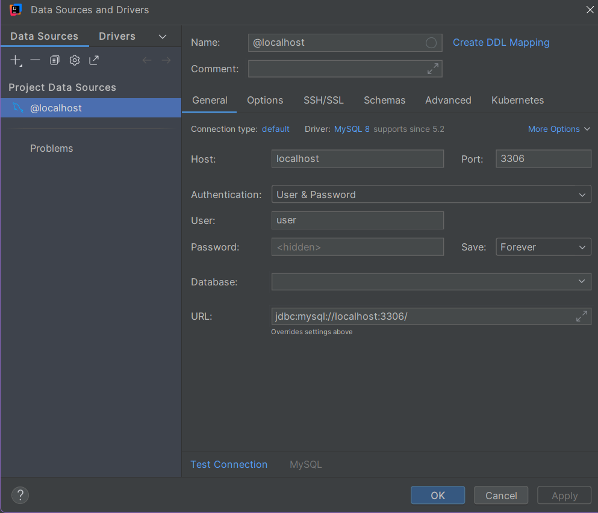
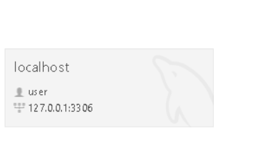
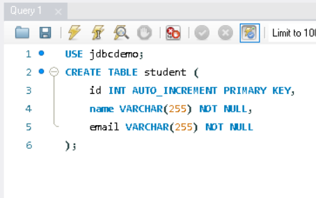
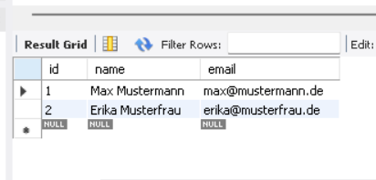
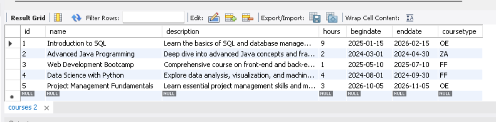

# JDBC

## AUFGABE 1: JDBC INTRO TEIL 1

- DB erstellen mit yaml

```yaml
version: "3.8"
services:
  db:
    image: mysql:8
    environment:
      MYSQL_ROOT_PASSWORD: 12345
      MYSQL_DATABASE: jdbcdemo
      MYSQL_USER: user
      MYSQL_PASSWORD: 12345
    ports:
      - "3306:3306"
    volumes:
      - db_data:/var/lib/mysql
volumes:
  db_data:
```

und dann mit CMD

```cmd
docker compose up
```

- Erstelen von Maven mysql dependency

```maven
    <dependencies>
        <dependency>
            <groupId>com.mysql</groupId>
            <artifactId>mysql-connector-j</artifactId>
            <version>9.5.0</version>
        </dependency>
    </dependencies>
```

- MYSQL conection erstellen version 1



- MYSQL conection erstellen version 2



- Tabele in DB erstellen



- Daten add in MYSQL

```mysql
INSERT INTO student (name, email) VALUES ('Max Mustermann', 'max@mustermann.de');
INSERT INTO student (name, email) VALUES ('Erika Musterfrau', 'erika@musterfrau.de');
```



- Verbindung zur DB über java

```java
import java.sql.Connection;
import java.sql.DriverManager;
import java.sql.SQLException;
import java.sql.SQLOutput;

public class JDBCdemo {

    public static void main(String[] args) {
        System.out.println("JDBC Demo!");
        selectAllDemo();
    }

    public static void selectAllDemo(){
        System.out.println("Select DEMO mit JDBC");
        //sql comand in eigene variable speicher
        //url für conection zu mysql db
        String connectionUrl ="jdbc:mysql://localhost:3306/jdbcdemo";
        //probiert sich zu DB zu verbinden
        try(Connection conn = DriverManager.getConnection(connectionUrl,"user","12345")){
            System.out.println("Verbindung zur DB herstellt!");
        } catch (SQLException e) {
            System.out.println("Fehler bei Aufbau der Verbindung zur DB: " + e.getMessage());
        }

    }
}
```

- _Select_

```java
try(Connection conn = DriverManager.getConnection(connectionUrl,"user","12345")){
           System.out.println("Verbindung zur DB herstellt!");
           String sqlSelectAllPersons ="SELECT * FROM `student`";
           //zufigen von vertigen sql statmenst schutzt von angrifen
           PreparedStatement preparedStatement = conn.prepareStatement(sqlSelectAllPersons);//stat variable ist auch möglich ("SELECT * FROM `student`")
           //
           ResultSet rs = preparedStatement.executeQuery();
           //für jeden ergebnis ausgeben so lange was in tb gibt
           while(rs.next()){
               //hold das was sich in erste spalte befindet und speichert in int
               int id = rs.getInt("id");//an stelle von "id" können wir schreiben 1 spalten nummer
               String name = rs.getString("name");
               String email = rs.getString("email");
               System.out.println("Student aus der DB - ID: " + id +" - Name: " + name + ", Email: " + email);
           }
       } catch (SQLException e) {
           System.out.println("Fehler bei Aufbau der Verbindung zur DB: " + e.getMessage());
       }
```

- _Insert_

```java
public static void insertStudentDemo(){
        System.out.println("Insert DEMO mit JDBC");
        //url für conection zu mysql db
        String connectionUrl ="jdbc:mysql://localhost:3306/jdbcdemo";
        //probiert sich zu DB zu verbinden
        try(Connection conn = DriverManager.getConnection(connectionUrl,"user","12345")){
            System.out.println("Verbindung zur DB herstellt!");
            //zufigen von vertigen sql statmenst schutzt von angrifen
            PreparedStatement preparedStatement = conn.prepareStatement("INSERT INTO `student` (name,email) VALUES ( ?,?)");
            try {
                preparedStatement.setString(1,"Peter Zeck");
                preparedStatement.setString(2,"p.zeck@hotmail.com");
                int rowAffected = preparedStatement.executeUpdate();
                System.out.println(rowAffected + " Datensätze eingefügt");
                //catch nur für insert
            }catch (SQLException ex){
                System.out.println("Fehle in SQL - Insert "+ex.getMessage());
            }

        } catch (SQLException e) {
            System.out.println("Fehler bei Aufbau der Verbindung zur DB: " + e.getMessage());
        }
    }
```

- _Update_

```java
public static void updateStudentDemo(){
        System.out.println("Insert DEMO mit JDBC");
        //url für conection zu mysql db
        String connectionUrl ="jdbc:mysql://localhost:3306/jdbcdemo";
        //probiert sich zu DB zu verbinden
        try(Connection conn = DriverManager.getConnection(connectionUrl,"user","12345")){
            System.out.println("Verbindung zur DB herstellt!");
            //zufigen von vertigen sql statmenst schutzt von angrifen
            PreparedStatement preparedStatement = conn.prepareStatement("UPDATE `student` SET `name` = ? WHERE `student`.`id` = 2");
            try {
                preparedStatement.setString(1,"Hans Zimmer");
                int affectedRows  = preparedStatement.executeUpdate();
                System.out.println(affectedRows + " Datensätze eingefügt");
                //catch nur für insert
            }catch (SQLException ex){
                System.out.println("Fehle in SQL - Update "+ex.getMessage());
            }

        } catch (SQLException e) {
            System.out.println("Fehler bei Aufbau der Verbindung zur DB: " + e.getMessage());
        }
    }
```

- _Delete_

```java
public static void deleteStudentDemo(int studentID){
        System.out.println("Delet DEMO mit JDBC");
        //url für conection zu mysql db
        String connectionUrl ="jdbc:mysql://localhost:3306/jdbcdemo";
        //probiert sich zu DB zu verbinden
        try(Connection conn = DriverManager.getConnection(connectionUrl,"user","12345")){
            System.out.println("Verbindung zur DB herstellt!");
            //zufigen von vertigen sql statmenst schutzt von angrifen
            PreparedStatement preparedStatement = conn.prepareStatement("DELETE FROM `student` WHERE `student`.`id` = ?");
            try {
                preparedStatement.setInt(1,studentID);
                int affectedRows  = preparedStatement.executeUpdate();
                System.out.println(affectedRows + " Datensätze die gelöst sind");
                //catch nur für insert
            }catch (SQLException ex){
                System.out.println("Fehle in SQL - Delete "+ex.getMessage());
            }

        } catch (SQLException e) {
            System.out.println("Fehler bei Aufbau der Verbindung zur DB: " + e.getMessage());
        }
    }
```

- _Like_

```java
private static void findAllByNameLike(String byName) {
        System.out.println("Finde all by Name DEMO mit JDBC");
        //url für conection zu mysql db
        String connectionUrl ="jdbc:mysql://localhost:3306/jdbcdemo";

        //probiert sich zu DB zu verbinden
        try(Connection conn = DriverManager.getConnection(connectionUrl,"user","12345")){
            System.out.println("Verbindung zur DB herstellt!");
            //zufigen von vertigen sql statmenst schutzt von angrifen
            PreparedStatement preparedStatement = conn.prepareStatement("SELECT * FROM `student` WHERE `student`.`name` LIKE ?");
            preparedStatement.setString(1,"%"+byName+"%");
            //abfrage an db
            ResultSet rs = preparedStatement.executeQuery();
            //für jeden ergebnis ausgeben so lange was in tb gibt
            while(rs.next()){
                //hold das was sich in erste spalte befindet und speichert in int
                int id = rs.getInt("id");//an stelle von "id" können wir schreiben 1 spalten nummer
                String name = rs.getString("name");
                String email = rs.getString("email");
                System.out.println("Student aus der DB - ID: " + id +" - Name: " + name + ", Email: " + email);
            }
        } catch (SQLException e) {
            System.out.println("Fehler bei Aufbau der Verbindung zur DB: " + e.getMessage());
        }
    }
```

## AUFGABE 2: JDBC INTRO TEIL 2


```java
import java.sql.*;
public class CityTabele {

    public static void main(String[] args) {
        System.out.println("Welcome to City Tabele");
        selectAllCity();
        insertCity("Nico Wollinger","Hall in Tirol", 6420);
    }
    public static void selectAllCity(){
        System.out.println("Select all from City");
        //prepar stament
        String sqlSelectAllCity ="SELECT * FROM city";
        //url connect db
        String connectionSQLUrl = "jdbc:mysql://localhost:3306/jdbcdemo";

        try(Connection conn = DriverManager.getConnection(connectionSQLUrl,"user","12345")){
            System.out.println("Verbindung zu DB herstellt");
            PreparedStatement preparedStatement = conn.prepareStatement(sqlSelectAllCity);
            ResultSet rs = preparedStatement.executeQuery();
            while(rs.next()){
                int id = rs.getInt("id");
                String name = rs.getString("namePerson");
                String city = rs.getString("city");
                int plz = rs.getInt("plz");
                System.out.println("Hello, ID: "+id+", deine Name ist: " +name + ", du komst aus: "+plz+" "+city);
            }
        }catch (SQLException e){
            System.out.println("Fehler bei Aufbau der Verbindung zur DB: " + e.getMessage());
        }
    }
    public static void insertCity(String name, String city,int plz){
        System.out.println("Insert City");
        String prepareCity = "INNSERT INTO `city` (`namePerson`,`city`,`plz`) VALUES (?,?,?)";
        String connectionSQLUrl = "jdbc:mysql://localhost:3306/jdbcdemo";

        try(Connection conn = DriverManager.getConnection(connectionSQLUrl,"user","12345")){
            System.out.println("Verbindung zu DB herstellt");
            PreparedStatement preparedStatement = conn.prepareStatement(prepareCity);
            try{
                preparedStatement.setString(1,name);
                preparedStatement.setString(2,city);
                preparedStatement.setInt(3,plz);
                int rowAffected = preparedStatement.executeUpdate();
                System.out.println(rowAffected + " Datensätze eingefügt");
            }catch(SQLException ex){
                System.out.println("Fehler bei Insert in DB: " + ex.getMessage());
            }
        } catch (SQLException e){
            System.out.println("Fehler bei Aufbau der Verbindung zur DB: " + e.getMessage());
        }
    }
}

```

## AUFGABE 3: JDBC UND DAO – KURSE

```mysql
CREATE TABLE courses (
    id INT PRIMARY KEY AUTO_INCREMENT,
    name VARCHAR(100) NOT NULL,
    description TEXT,
    hours INT,
    begindate DATE,
    enddate DATE,
    coursetype VARCHAR(50)
);

INSERT INTO courses (name, description, hours, begindate, enddate, coursetype) VALUES
('Introduction to SQL', 'Learn the basics of SQL and database management.', 9, '2025-01-15', '2026-02-15', 'OE'),
('Advanced Java Programming', 'Deep dive into advanced Java concepts and frameworks.', 2, '2024-03-01', '2024-04-30', 'ZA'),
('Web Development Bootcamp', 'Comprehensive course on front-end and back-end web development.', 1, '2025-05-10', '2025-07-10', 'FF'),
('Data Science with Python', 'Explore data analysis, visualization, and machine learning using Python.', 4, '2024-08-01', '2024-09-30', 'FF'),
('Project Management Fundamentals', 'Learn essential project management skills and methodologies.', 3, '2026-10-05', '2026-11-05', 'OE');

select * from courses;
```


