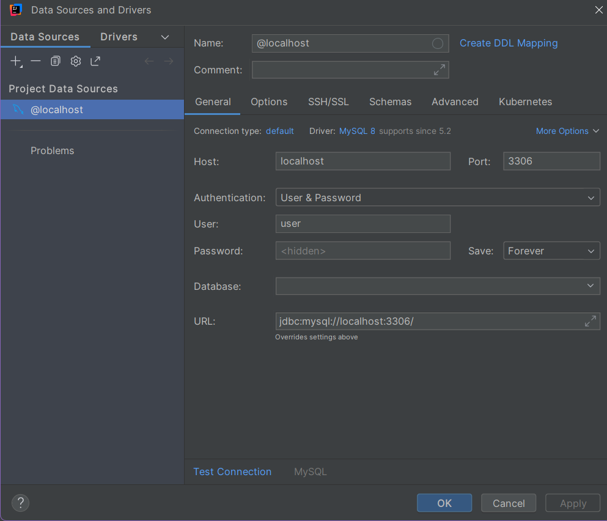
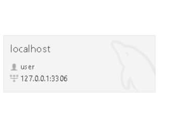
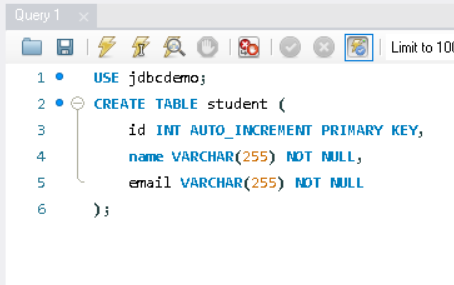
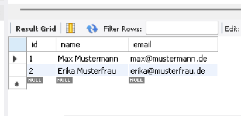
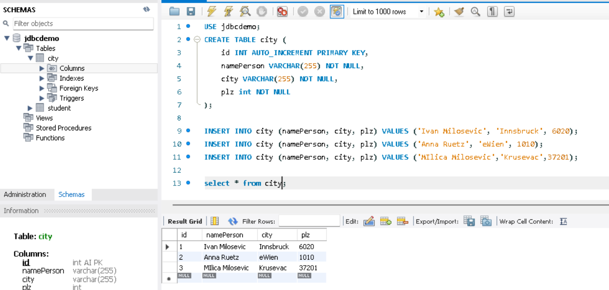
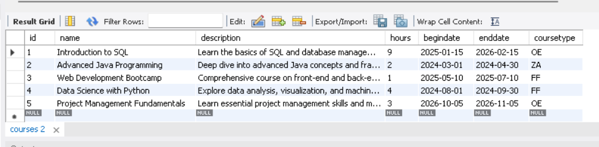
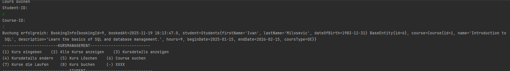

# JDBC

## AUFGABE 1: JDBC INTRO TEIL 1

- DB erstellen mit yaml

```yaml
version: "3.8"
services:
  db:
    image: mysql:8
    environment:
      MYSQL_ROOT_PASSWORD: 12345
      MYSQL_DATABASE: jdbcdemo
      MYSQL_USER: user
      MYSQL_PASSWORD: 12345
    ports:
      - "3306:3306"
    volumes:
      - db_data:/var/lib/mysql
volumes:
  db_data:
```

und dann mit CMD

```cmd
docker compose up
```

- Erstelen von Maven mysql dependency

```maven
    <dependencies>
        <dependency>
            <groupId>com.mysql</groupId>
            <artifactId>mysql-connector-j</artifactId>
            <version>9.5.0</version>
        </dependency>
    </dependencies>
```

- MYSQL conection erstellen version 1



- MYSQL conection erstellen version 2



- Tabele in DB erstellen



- Daten add in MYSQL

```mysql
INSERT INTO student (name, email) VALUES ('Max Mustermann', 'max@mustermann.de');
INSERT INTO student (name, email) VALUES ('Erika Musterfrau', 'erika@musterfrau.de');
```



- Verbindung zur DB über java

```java
import java.sql.Connection;
import java.sql.DriverManager;
import java.sql.SQLException;
import java.sql.SQLOutput;

public class JDBCdemo {

    public static void main(String[] args) {
        System.out.println("JDBC Demo!");
        selectAllDemo();
    }

    public static void selectAllDemo(){
        System.out.println("Select DEMO mit JDBC");
        //sql comand in eigene variable speicher
        //url für conection zu mysql db
        String connectionUrl ="jdbc:mysql://localhost:3306/jdbcdemo";
        //probiert sich zu DB zu verbinden
        try(Connection conn = DriverManager.getConnection(connectionUrl,"user","12345")){
            System.out.println("Verbindung zur DB herstellt!");
        } catch (SQLException e) {
            System.out.println("Fehler bei Aufbau der Verbindung zur DB: " + e.getMessage());
        }

    }
}
```

- _Select_

```java
try(Connection conn = DriverManager.getConnection(connectionUrl,"user","12345")){
           System.out.println("Verbindung zur DB herstellt!");
           String sqlSelectAllPersons ="SELECT * FROM `student`";
           //zufigen von vertigen sql statmenst schutzt von angrifen
           PreparedStatement preparedStatement = conn.prepareStatement(sqlSelectAllPersons);//stat variable ist auch möglich ("SELECT * FROM `student`")
           //
           ResultSet rs = preparedStatement.executeQuery();
           //für jeden ergebnis ausgeben so lange was in tb gibt
           while(rs.next()){
               //hold das was sich in erste spalte befindet und speichert in int
               int id = rs.getInt("id");//an stelle von "id" können wir schreiben 1 spalten nummer
               String name = rs.getString("name");
               String email = rs.getString("email");
               System.out.println("Student aus der DB - ID: " + id +" - Name: " + name + ", Email: " + email);
           }
       } catch (SQLException e) {
           System.out.println("Fehler bei Aufbau der Verbindung zur DB: " + e.getMessage());
       }
```

- _Insert_

```java
public static void insertStudentDemo(){
        System.out.println("Insert DEMO mit JDBC");
        //url für conection zu mysql db
        String connectionUrl ="jdbc:mysql://localhost:3306/jdbcdemo";
        //probiert sich zu DB zu verbinden
        try(Connection conn = DriverManager.getConnection(connectionUrl,"user","12345")){
            System.out.println("Verbindung zur DB herstellt!");
            //zufigen von vertigen sql statmenst schutzt von angrifen
            PreparedStatement preparedStatement = conn.prepareStatement("INSERT INTO `student` (name,email) VALUES ( ?,?)");
            try {
                preparedStatement.setString(1,"Peter Zeck");
                preparedStatement.setString(2,"p.zeck@hotmail.com");
                int rowAffected = preparedStatement.executeUpdate();
                System.out.println(rowAffected + " Datensätze eingefügt");
                //catch nur für insert
            }catch (SQLException ex){
                System.out.println("Fehle in SQL - Insert "+ex.getMessage());
            }

        } catch (SQLException e) {
            System.out.println("Fehler bei Aufbau der Verbindung zur DB: " + e.getMessage());
        }
    }
```

- _Update_

```java
public static void updateStudentDemo(){
        System.out.println("Insert DEMO mit JDBC");
        //url für conection zu mysql db
        String connectionUrl ="jdbc:mysql://localhost:3306/jdbcdemo";
        //probiert sich zu DB zu verbinden
        try(Connection conn = DriverManager.getConnection(connectionUrl,"user","12345")){
            System.out.println("Verbindung zur DB herstellt!");
            //zufigen von vertigen sql statmenst schutzt von angrifen
            PreparedStatement preparedStatement = conn.prepareStatement("UPDATE `student` SET `name` = ? WHERE `student`.`id` = 2");
            try {
                preparedStatement.setString(1,"Hans Zimmer");
                int affectedRows  = preparedStatement.executeUpdate();
                System.out.println(affectedRows + " Datensätze eingefügt");
                //catch nur für insert
            }catch (SQLException ex){
                System.out.println("Fehle in SQL - Update "+ex.getMessage());
            }

        } catch (SQLException e) {
            System.out.println("Fehler bei Aufbau der Verbindung zur DB: " + e.getMessage());
        }
    }
```

- _Delete_

```java
public static void deleteStudentDemo(int studentID){
        System.out.println("Delet DEMO mit JDBC");
        //url für conection zu mysql db
        String connectionUrl ="jdbc:mysql://localhost:3306/jdbcdemo";
        //probiert sich zu DB zu verbinden
        try(Connection conn = DriverManager.getConnection(connectionUrl,"user","12345")){
            System.out.println("Verbindung zur DB herstellt!");
            //zufigen von vertigen sql statmenst schutzt von angrifen
            PreparedStatement preparedStatement = conn.prepareStatement("DELETE FROM `student` WHERE `student`.`id` = ?");
            try {
                preparedStatement.setInt(1,studentID);
                int affectedRows  = preparedStatement.executeUpdate();
                System.out.println(affectedRows + " Datensätze die gelöst sind");
                //catch nur für insert
            }catch (SQLException ex){
                System.out.println("Fehle in SQL - Delete "+ex.getMessage());
            }

        } catch (SQLException e) {
            System.out.println("Fehler bei Aufbau der Verbindung zur DB: " + e.getMessage());
        }
    }
```

- _Like_

```java
private static void findAllByNameLike(String byName) {
        System.out.println("Finde all by Name DEMO mit JDBC");
        //url für conection zu mysql db
        String connectionUrl ="jdbc:mysql://localhost:3306/jdbcdemo";

        //probiert sich zu DB zu verbinden
        try(Connection conn = DriverManager.getConnection(connectionUrl,"user","12345")){
            System.out.println("Verbindung zur DB herstellt!");
            //zufigen von vertigen sql statmenst schutzt von angrifen
            PreparedStatement preparedStatement = conn.prepareStatement("SELECT * FROM `student` WHERE `student`.`name` LIKE ?");
            preparedStatement.setString(1,"%"+byName+"%");
            //abfrage an db
            ResultSet rs = preparedStatement.executeQuery();
            //für jeden ergebnis ausgeben so lange was in tb gibt
            while(rs.next()){
                //hold das was sich in erste spalte befindet und speichert in int
                int id = rs.getInt("id");//an stelle von "id" können wir schreiben 1 spalten nummer
                String name = rs.getString("name");
                String email = rs.getString("email");
                System.out.println("Student aus der DB - ID: " + id +" - Name: " + name + ", Email: " + email);
            }
        } catch (SQLException e) {
            System.out.println("Fehler bei Aufbau der Verbindung zur DB: " + e.getMessage());
        }
    }
```

## AUFGABE 2: JDBC INTRO TEIL 2



```java
import java.sql.*;
public class CityTabele {

    public static void main(String[] args) {
        System.out.println("Welcome to City Tabele");
        selectAllCity();
        insertCity("Nico Wollinger","Hall in Tirol", 6420);
    }
    public static void selectAllCity(){
        System.out.println("Select all from City");
        //prepar stament
        String sqlSelectAllCity ="SELECT * FROM city";
        //url connect db
        String connectionSQLUrl = "jdbc:mysql://localhost:3306/jdbcdemo";

        try(Connection conn = DriverManager.getConnection(connectionSQLUrl,"user","12345")){
            System.out.println("Verbindung zu DB herstellt");
            PreparedStatement preparedStatement = conn.prepareStatement(sqlSelectAllCity);
            ResultSet rs = preparedStatement.executeQuery();
            while(rs.next()){
                int id = rs.getInt("id");
                String name = rs.getString("namePerson");
                String city = rs.getString("city");
                int plz = rs.getInt("plz");
                System.out.println("Hello, ID: "+id+", deine Name ist: " +name + ", du komst aus: "+plz+" "+city);
            }
        }catch (SQLException e){
            System.out.println("Fehler bei Aufbau der Verbindung zur DB: " + e.getMessage());
        }
    }
    public static void insertCity(String name, String city,int plz){
        System.out.println("Insert City");
        String prepareCity = "INNSERT INTO `city` (`namePerson`,`city`,`plz`) VALUES (?,?,?)";
        String connectionSQLUrl = "jdbc:mysql://localhost:3306/jdbcdemo";

        try(Connection conn = DriverManager.getConnection(connectionSQLUrl,"user","12345")){
            System.out.println("Verbindung zu DB herstellt");
            PreparedStatement preparedStatement = conn.prepareStatement(prepareCity);
            try{
                preparedStatement.setString(1,name);
                preparedStatement.setString(2,city);
                preparedStatement.setInt(3,plz);
                int rowAffected = preparedStatement.executeUpdate();
                System.out.println(rowAffected + " Datensätze eingefügt");
            }catch(SQLException ex){
                System.out.println("Fehler bei Insert in DB: " + ex.getMessage());
            }
        } catch (SQLException e){
            System.out.println("Fehler bei Aufbau der Verbindung zur DB: " + e.getMessage());
        }
    }
}

```

## AUFGABE 3: JDBC UND DAO – KURSE

```mysql
CREATE TABLE courses (
    id INT PRIMARY KEY AUTO_INCREMENT,
    name VARCHAR(100) NOT NULL,
    description TEXT,
    hours INT,
    begindate DATE,
    enddate DATE,
    coursetype VARCHAR(50)
);

INSERT INTO courses (name, description, hours, begindate, enddate, coursetype) VALUES
('Introduction to SQL', 'Learn the basics of SQL and database management.', 9, '2025-01-15', '2026-02-15', 'OE'),
('Advanced Java Programming', 'Deep dive into advanced Java concepts and frameworks.', 2, '2024-03-01', '2024-04-30', 'ZA'),
('Web Development Bootcamp', 'Comprehensive course on front-end and back-end web development.', 1, '2025-05-10', '2025-07-10', 'FF'),
('Data Science with Python', 'Explore data analysis, visualization, and machine learning using Python.', 4, '2024-08-01', '2024-09-30', 'FF'),
('Project Management Fundamentals', 'Learn essential project management skills and methodologies.', 3, '2026-10-05', '2026-11-05', 'OE');

select * from courses;
```



## DAO Aufgabe 5 - Booking

Leider hat Coopilot das nicht zu ende gebracht da ich nur begrentzte zugang habe

Das hat er gemacht:

```java
package dataaccess;

import domain.Booking;
import domain.BookingInfo;

import java.util.List;
import java.util.Optional;

public interface BookingRepository {
    Optional<Booking> findById(Long id) throws DatabaseException;
    List<Booking> findByStudentId(Long studentId) throws DatabaseException;
    Optional<Booking> findByStudentAndCourse(Long studentId, Long courseId) throws DatabaseException;
    Long create(Long studentId, Long courseId) throws DatabaseException;
    Optional<BookingInfo> findBookingInfoById(Long bookingId) throws DatabaseException;
}

package dataaccess;

import domain.Booking;
import domain.BookingInfo;
import domain.Course;
import domain.Students;
import domain.InvalidValueException;

import java.sql.*;
import java.util.ArrayList;
import java.util.List;
import java.util.Optional;

public class MySqlBookingRepository implements BookingRepository{
    private Connection conn;

    public MySqlBookingRepository() throws SQLException, ClassNotFoundException {
        this.conn = MysqlDatabaseConnection.getConnection("jdbc:mysql://localhost:3306/jdbcdemo","user","12345");
    }

    @Override
    public Optional<Booking> findById(Long id) throws DatabaseException {
        try{
            String sql = "select * from bookings where id = ?";
            PreparedStatement ps = conn.prepareStatement(sql);
            ps.setLong(1,id);
            ResultSet rs = ps.executeQuery();
            if(rs.next()){
                return Optional.of(new Booking(
                        rs.getLong("id"),
                        rs.getLong("student_id"),
                        rs.getLong("course_id"),
                        rs.getTimestamp("booked_at")
                ));
            }
            return Optional.empty();
        }catch (SQLException e){
            throw new DatabaseException(e.getMessage());
        }
    }

    @Override
    public List<Booking> findByStudentId(Long studentId) throws DatabaseException {
        try{
            String sql = "select * from bookings where student_id = ?";
            PreparedStatement ps = conn.prepareStatement(sql);
            ps.setLong(1, studentId);
            ResultSet rs = ps.executeQuery();
            ArrayList<Booking> list = new ArrayList<>();
            while(rs.next()){
                list.add(new Booking(
                        rs.getLong("id"),
                        rs.getLong("student_id"),
                        rs.getLong("course_id"),
                        rs.getTimestamp("booked_at")
                ));
            }
            return list;
        }catch (SQLException e){
            throw new DatabaseException(e.getMessage());
        }
    }

    @Override
    public Optional<Booking> findByStudentAndCourse(Long studentId, Long courseId) throws DatabaseException {
        try{
            String sql = "select * from bookings where student_id = ? and course_id = ?";
            PreparedStatement ps = conn.prepareStatement(sql);
            ps.setLong(1, studentId);
            ps.setLong(2, courseId);
            ResultSet rs = ps.executeQuery();
            if(rs.next()){
                return Optional.of(new Booking(
                        rs.getLong("id"),
                        rs.getLong("student_id"),
                        rs.getLong("course_id"),
                        rs.getTimestamp("booked_at")
                ));
            }
            return Optional.empty();
        }catch (SQLException e){
            throw new DatabaseException(e.getMessage());
        }
    }

    @Override
    public Long create(Long studentId, Long courseId) throws DatabaseException {
        try{
            String sql = "insert into bookings (student_id, course_id, booked_at) values (?,?,CURRENT_TIMESTAMP)";
            PreparedStatement ps = conn.prepareStatement(sql, Statement.RETURN_GENERATED_KEYS);
            ps.setLong(1, studentId);
            ps.setLong(2, courseId);
            int affected = ps.executeUpdate();
            if(affected==0) throw new DatabaseException("Booking konnte nicht erstellt werden");
            ResultSet gen = ps.getGeneratedKeys();
            if(gen.next()) return gen.getLong(1);
            throw new DatabaseException("Kein generierter Key nach Insert");
        }catch (SQLException e){
            // Map integrity constraint violations (duplicate booking / FK) to domain exception
            String msg = e.getMessage() == null ? "" : e.getMessage().toLowerCase();
            int errorCode = e.getErrorCode();
            String sqlState = e.getSQLState();

            boolean integrityViolation = e instanceof SQLIntegrityConstraintViolationException
                    || (sqlState != null && sqlState.startsWith("23"))
                    || msg.contains("duplicate") || msg.contains("unique")
                    || errorCode == 1062; // MySQL duplicate entry

            if(integrityViolation){
                // If it's a duplicate entry on (student_id, course_id) we translate to a friendly message
                if(msg.contains("duplicate") || errorCode == 1062 || msg.contains("unique")){
                    throw new InvalidValueException("Student hat diesen Kurs bereits gebucht");
                }
                // FK violation or other integrity error
                throw new InvalidValueException("Integritätsfehler beim Erstellen der Buchung: " + e.getMessage());
            }

            throw new DatabaseException(e.getMessage());
        }
    }

    @Override
    public Optional<BookingInfo> findBookingInfoById(Long bookingId) throws DatabaseException {
        try{
            String sql = "select b.id as booking_id, b.booked_at, s.id as student_id, s.firstname, s.lastname, s.birthday, c.id as course_id, c.name, c.description, c.hours, c.begindate, c.enddate, c.coursetype from bookings b join students s on b.student_id = s.id join courses c on b.course_id = c.id where b.id = ?";
            PreparedStatement ps = conn.prepareStatement(sql);
            ps.setLong(1, bookingId);
            ResultSet rs = ps.executeQuery();
            if(rs.next()){
                Students s = new Students(
                        rs.getLong("student_id"),
                        rs.getString("firstname"),
                        rs.getString("lastname"),
                        rs.getDate("birthday")
                );
                Course c = new Course(
                        rs.getLong("course_id"),
                        rs.getString("name"),
                        rs.getString("description"),
                        rs.getInt("hours"),
                        rs.getDate("begindate"),
                        rs.getDate("enddate"),
                        domain.CourseType.valueOf(rs.getString("coursetype"))
                );
                BookingInfo info = new BookingInfo(
                        rs.getLong("booking_id"),
                        rs.getTimestamp("booked_at"),
                        s,
                        c
                );
                return Optional.of(info);
            }
            return Optional.empty();
        }catch (SQLException e){
            throw new DatabaseException(e.getMessage());
        }
    }
}

package domain;

import java.sql.Timestamp;

public class Booking extends BaseEntity {
    private Long studentId;
    private Long courseId;
    private Timestamp bookedAt;

    public Booking(Long id, Long studentId, Long courseId, Timestamp bookedAt) {
        super(id);
        this.studentId = studentId;
        this.courseId = courseId;
        this.bookedAt = bookedAt;
    }

    public Booking(Long studentId, Long courseId, Timestamp bookedAt) {
        super(null);
        this.studentId = studentId;
        this.courseId = courseId;
        this.bookedAt = bookedAt;
    }

    public Long getStudentId() {
        return studentId;
    }

    public Long getCourseId() {
        return courseId;
    }

    public Timestamp getBookedAt() {
        return bookedAt;
    }

    @Override
    public String toString() {
        return "Booking{" +
                "id=" + this.getId() +
                ", studentId=" + studentId +
                ", courseId=" + courseId +
                ", bookedAt=" + bookedAt +
                '}';
    }
}

package domain;

import java.sql.Timestamp;

public class BookingInfo {
    private Long bookingId;
    private Timestamp bookedAt;
    private Students student;
    private Course course;

    public BookingInfo(Long bookingId, Timestamp bookedAt, Students student, Course course) {
        this.bookingId = bookingId;
        this.bookedAt = bookedAt;
        this.student = student;
        this.course = course;
    }

    public Long getBookingId() {
        return bookingId;
    }

    public Timestamp getBookedAt() {
        return bookedAt;
    }

    public Students getStudent() {
        return student;
    }

    public Course getCourse() {
        return course;
    }

    @Override
    public String toString() {
        return "BookingInfo{" +
                "bookingId=" + bookingId +
                ", bookedAt=" + bookedAt +
                ", student=" + student +
                ", course=" + course +
                '}';
    }
}

package service;

import dataaccess.BookingRepository;
import dataaccess.MySqlBookingRepository;
import dataaccess.MyCourseRepository;
import dataaccess.MySqlCourseRepository;
import dataaccess.MyStudentsRepository;
import dataaccess.MySqlStudentsRepository;
import dataaccess.DatabaseException;
import domain.BookingInfo;
import domain.Booking;
import domain.Course;
import domain.Students;
import domain.InvalidValueException;

import java.sql.Connection;
import java.sql.SQLException;
import java.sql.Statement;
import java.sql.PreparedStatement;
import java.sql.ResultSet;
import java.util.Optional;

public class BookingService {
    private BookingRepository bookingRepository;
    private MyCourseRepository courseRepository;
    private MyStudentsRepository studentsRepository;

    public BookingService(BookingRepository bookingRepository, MyCourseRepository courseRepository, MyStudentsRepository studentsRepository){
        this.bookingRepository = bookingRepository;
        this.courseRepository = courseRepository;
        this.studentsRepository = studentsRepository;
    }

    public BookingInfo createBooking(Long studentId, Long courseId) throws InvalidValueException, DatabaseException {
        if(studentId == null || studentId <= 0) throw new InvalidValueException("Ungültige Student-ID");
        if(courseId == null || courseId <= 0) throw new InvalidValueException("Ungültige Course-ID");

        try{
            // Prüfen ob Student existiert
            Optional<Students> sOpt = studentsRepository.getById(studentId);
            if(sOpt.isEmpty()) throw new InvalidValueException("Student nicht gefunden");

            // Prüfen ob Course existiert
            Optional<Course> cOpt = courseRepository.getById(courseId);
            if(cOpt.isEmpty()) throw new InvalidValueException("Course nicht gefunden");

            // Prüfen ob bereits gebucht
            Optional<Booking> existing = bookingRepository.findByStudentAndCourse(studentId, courseId);
            if(existing.isPresent()) throw new InvalidValueException("Student hat diesen Kurs bereits gebucht");

            // Versuch Booking anzulegen (Repository wirft DatabaseException bei Problemen)
            Long bookingId = bookingRepository.create(studentId, courseId);
            Optional<BookingInfo> info = bookingRepository.findBookingInfoById(bookingId);
            if(info.isPresent()) return info.get();
            throw new DatabaseException("Booking erstellt, aber konnte nicht gelesen werden");
        } catch (SQLException e){
            throw new DatabaseException(e.getMessage());
        }
    }
}

```

Habe bisschen mitgemacht und


```java
//BOOKING
    case "23":
        System.out.println("Cours buchen");
        bookCourse();
        break;

private void bookCourse(){
        try{
            System.out.println("Student-ID:");
            Long studentId = Long.parseLong(scan.nextLine());
            System.out.println("Course-ID:");
            Long courseId = Long.parseLong(scan.nextLine());

            BookingInfo info = bookingService.createBooking(studentId, courseId);
            System.out.println("Buchung erfolgreich: " + info);
        } catch (IllegalArgumentException ia){
            System.out.println("Fehler bei der Eingabe: " + ia.getMessage());
        } catch (InvalidValueException ive){
            System.out.println("Ungültiger Wert: " + ive.getMessage());
        } catch (DatabaseException de){
            System.out.println("Datenbankfehler: " + de.getMessage());
        } catch (Exception e){
            System.out.println("Allgemeiner Fehler: " + e.getMessage());
        }
    }

    System.out.println("----------------------------BOOKING-----------------------------");
        System.out.println("(21) XXXXX \t (22) XXXX \t"+"(23) Kurs Buchen");
        System.out.println("(24) XXXX \t (25) xxxx \t (26) XXXX");
        System.out.println("(27) XXXXXXXXX \t (-) XXXX \t (-) XXXX");
```
